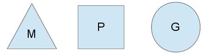
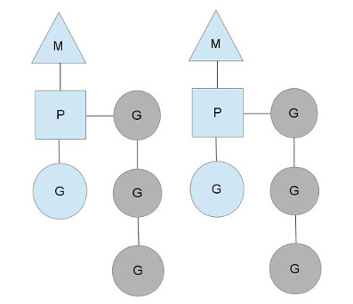
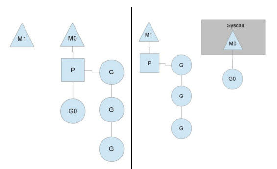

golang 调度器模型  GPM      https://www.zhihu.com/question/20862617/answer/27964865

### 操作系统中的一些概念
1. 什么是POSIX标准
   POSIX表示可移植操作系统接口（Portable Operating System Interface of UNIX，缩写为 POSIX ），POSIX标准定义了操作系统应该为应用程序提供的接口标准，这个标准的发布是为了获得源代码级别的软件可移植性。举个例子，一个在POSIX兼容的操作系统编写的程序，应该可以在任何其它的POSIX操作系统（即使是来自另一个厂商）上编译执行。

2. 操作系统进程/线程调度
   当多进程同时竞争CPU时，只要有超过两个的进程处于就绪态，那么单CPU必须选择下一个要运行的进程，完成选择工作的程序称为调度程序（也称CPU调度器），线程的调度与进程类似。

3. 内核线程和用户线程
   计算机中线程可以分为内核线程和用户线程。用户就是运行于操作系统之上应用的线程，而内核线程则是操作系统创建的线程，因为操作系统是为应用提供服务的，比如管理软硬件资源、响应用户进程的种种合理以及不合理的要求。因此可以理解为内核线程代理了用户线程要做的工作。

### golang 调度器相关
1. 什么是GPM模型

   GPM是Golang的调度模型，作为Golang 1.1版本中的一个新的特性被发布。这个调度器可以在开发不改变任何原先代码的情况下使得Golang并行程序获得一个巨大的性能提升。性能提升的原因在于GPM调度器为我们做了协程调度的工作，使得协程之间的协作和切换更加高效。GPM模型主要由G，P，M三个结构体组成，代码实现在GOROOT/src/runtime/runtime2.go文件里。这部分我会在第三小节进行详细介绍。

2. 为什么Golang需要调度器

   我们知道操作系统提供了线程的调度功能，那么为什么golang还需要在用户空间创建一个调度器呢？
   首先无论是进程还是线程，它们的切换都需要一些资源开销，这个机制在操作系统中程序能够有序的运行。而在Golang协程的场景下情况就变了。协程粒度相比进程和线程都更小，系统中起百万数量级别的协程再正常不过，可以想象如果协程同样使用操作系统的调度机制，那么要耗费多少资源。这些都增加了Golang使用goroutine所不需要的资源开销。在Golang调度器的调度机制中，当一个Goroutine在进行阻塞操作（比如系统调用）时，调度器会把当前线程中的其他Goroutine移交到其他线程中继续执行， 从而避免了整个程序的阻塞，大大提升应用性能。

   另一个问题是操作系统的调度策略在Golang编程模型中发挥的功能比较有限。因为Golang在进行垃圾的时候要求停止所有线程程，并且内存必须处于一致性状态，这涉及等待运行线程到达内存一致性的那个时间点，操作系统的调度是不能感知到这个时间点的。而Golang自己的调度器能够时刻知道内存状态，进行一次GC消耗的代价可以降低到最小。

3. 调度器的设计

   首先介绍一下线程调度模型，即用户线程和内核线程的对应关系，分别为一对一模型、多对一模型和多对多模型。其中一对一模型是最简单的一种线程模型了，一个用户线程唯一对应一个内核线程，
   线程之间可以做到最大程度的并发，不同线程之间不会相互影响，比如一个线程阻塞了也不会影响到其他线程的执行。对于多处理器，一对一的线程模型效率更高。
   但是很多操作系统限制了内核线程的数量，如果采用一对一模型，用户线程的数量也会受到比较大的限制。而且很多操作系统的内核线程在调度时开销较大，这也会影响用户线程的效率。

   多对一模型意味着多个用户线程对应一个内核线程，用户线程间的切换由代码控制，因为线程间切换的效率比较高(不用陷入内核区去切换)。但是如果其中一个用户线程阻塞了，
   那么和它对应相同内核线程的那些用户线程也都会阻塞，因为内核线程是被共用的(且是绑定的)，此时它无法抽身出来。而且增加处理器个数对于多对一线程模型帮助也不大，
   毕竟在这种情况下，一个线程阻塞，相关线程也跟着遭殃的事实和处理器个数关系不大。这种模型的好处是线程间切换开销低，且线程数量可以很多。

   多对多线程模型可以说是上面两种模型的结合，也是最复杂的，它把多个用户线程对应到多个内核线程上，且很多时候不是唯一绑定的。
   因此一个内核线程在一个时间点可以对应0到多个用户线程。且在运行期间，系统可以根据线程执行情况做合理分配。比如用户线程1、用户线程2和用户线程3对应到一个内核线程1，
   如果用户线程1阻塞了，系统可以调度用户线程2和用户线程3到其他内核线程上去，这是个动态的过程。多对多线程模型的优势是可以让系统资源得到比较均衡的使用，
   用户线程之间互相影响比较小，且在多处理器上表现不错(虽然增加处理器个数对它性能提升可能不如一对一模型那么高)，关键是它很灵活。

   Golang的调度器采用的是多对多的模型结构，为了完成协程的任务调度，调度器使用了以下三个对象
   
    其中M表示内核线程；P代表调度的上下文，P是实现从多对一到多对多的关键部分；而G代表一个协程也就是Goroutine。
   
   现在举例系统中有两个M（内核线程），每个内核线程都有一个P（运行上下文），每个内核线程运行多个G（Goroutine）
   
   
   
   P的数量可以通过运行时函数GOMAXPROCS()来设置，它其实也就代表了真正的并发度，即有多少个goroutine可以同时运行。图中灰色的那些goroutine并没有运行，而是处于ready的就绪态，
   正在等待被调度。P维护着这个队列（称之为runqueue），Go语言里，启动一个goroutine很容易，只要在函数前加一个go关键字就行就行，所以每有一个go语句被执行，
   P的runqueue队列就在其末尾加入一个goroutine，在下一个调度点，就从runqueue中取出（如何决定取哪个goroutine？）一个goroutine执行。说到这里我们可能会有一个问题，
   为何要维护多个上下文P呢？这是因为当一个内核线程被阻塞时，该内核线程所属的协程都会被阻塞，如果把所有协程都切换到另一个内核线程是不是太麻烦了。因此每个内核线程
   都维护了一个上下文，每个上下文再管理多个协程。切换协程的时候只需要切换上下文。这个就跟公司员工多了使用分级管理的策略是一样的，可以提升效率。
   
   
   
   以上是Golang调度器的基本设计。下面我来介绍一下调度器的实现
   
4. 调度器的实现
    主要源码实现 src/runtime/proc.go  /src/runtime/runtime2.go        https://blog.csdn.net/robertkun/article/details/80035648
   