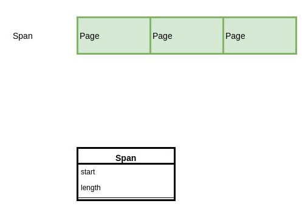
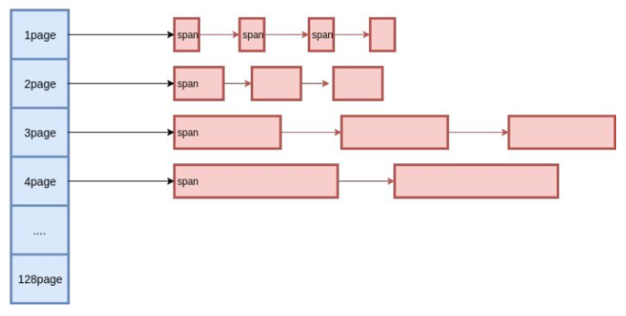

### 编程语言内存管理的基本特点：
  内置运行时的编程语言通常会有一个内存自主管理的机制，这样可以完成类似内存预分配、内存池等操作以避免频繁的系统调用带来的性能
问题。并且自主内存管理还可以更好的配合垃圾回收。内存管理大致策略如下：
* 申请一块较大的地址空间（虚拟内存），用于内存分配及管理（golang：spans+bitmap+arena->512M+16G+512G）
* 当空间不足时，向系统申请一块较大的内存，如100KB或者1MB
* 申请到的内存块按特定的size，被分割成多种小块内存（golang：_NumSizeClasses = 67），并用链表管理起来
* 创建对象时，按照对象大小，从空闲链表中查找到最适合的内存块
* 销毁对象时，将对应的内存块返还空闲链表中以复用
* 空闲内存达到阈值时，返还操作系统

### 什么是虚拟内存，为什么需要虚拟内存 
* 虚拟内存是计算机系统内存管理的一种技术。它使得应用程序认为它拥有连续的可用的内存（一个连续完整的地址空间），而实际上，
它通常是被分隔成多个物理内存碎片，还有部分暂时存储在外部磁盘存储器上，在需要时进行数据交换。

* 虚拟内存机制 https://www.cnblogs.com/shijingjing07/p/5611579.html

#### tcmalloc浅析  https://yq.aliyun.com/articles/6045
内存分配粒度：在tcmalloc里面，有两种粒度的内存，object和span。span是连续page的内存，而object则是由span切成的小块。
object的尺寸被预设了一些规格（class），比如16字节、32字节、等等，同一个span切出来的object都是相同的规格。object不大于256K，
超大的内存将直接分配span来使用。ThreadCache和CentralCache都是管理object，而PageHeap管理的是span。

Golang的内存分配基于两种粒度的内存单位,分别是span和object。span是连续的page，按page的数量进行归类，比如分为2个page的span，
4个page的span等。object是span中按预设大小划分的块，也是按大小分类。同一个span中，所有object的大小都是一样的。
page永远不会独立存在，需要依赖于span，span与page的关系如下图所示：

#### mspan源码分析   https://blog.csdn.net/caoshulin1989/article/details/50705168?locationNum=9&fps=1

malloc 采用位图实现（https://blog.csdn.net/qq_31828515/article/details/56853478）

mspan不需要加锁，说明是线程内自己分配

在Golang中，当我们new一个对象时。系统会执行malloc.go中的 newobject(typ *_type)方法，并返回对象的地址 unsafe.Pointer

tcmalloc原理   http://legendtkl.com/2015/12/11/go-memory/
               http://goog-perftools.sourceforge.net/doc/tcmalloc.html
               https://blog.csdn.net/chosen0ne/article/details/9338591
内存分配理论   https://www.cnblogs.com/ldaniel/p/8502867.html?utm_source=debugrun&utm_medium=referral
golang 内存管理 + 垃圾回收 （可参考） https://blog.csdn.net/qq_17612199/article/details/80278632
#### 内存分配源码   https://www.cnblogs.com/yjf512/p/5147365.html  结合博客写文章

golang 内存管理 + 垃圾回收   https://blog.csdn.net/qq_17612199/article/details/80278632
Go语言内存管理（一）内存分配（深度好文） https://www.cnblogs.com/ldaniel/p/8502867.html?utm_source=debugrun&utm_medium=referral
图解TCMalloc https://zhuanlan.zhihu.com/p/29216091  （好文）

### goroutine与调度器 (深度好文) https://studygolang.com/articles/1855

